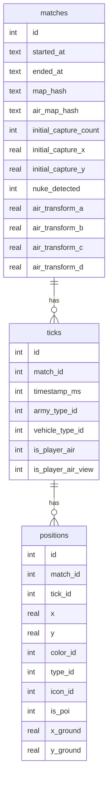

# WarThunder Plotter: A Deep Dive Into DB Size Optimization

## 1. Context and Goals

WarThunder Plotter captures live match telemetry from the War Thunder local API and renders it in a web UI. The capture loop is fast, which means a lot of data lands in SQLite very quickly. The system worked, but the file size exploded because the schema stored the same metadata in every position row, and because some match fields were duplicates of information already embedded in the map hash. The goal was to keep the behavior identical while reducing storage and making the data model easier to reason about.

The first phase was about understanding what actually grew the file. Each capture tick generated a timestamp and a small set of metadata, then every object captured in that tick repeated those values. That pattern is fine for a quick prototype, but at scale it becomes a guaranteed bloat multiplier. At the same time, the `matches` table stored map name, map ID, and battle type, even though those values can be derived from the map hash. That redundancy added size and created a risk of drift if the hash mapping ever changes.

## 2. Strategy and Implementation

The refactor focused on two principles: normalize repeated values and derive what can be derived. We introduced enum tables for repeated strings such as color, icon, and vehicle. This allowed the rows to store integer IDs instead of long text values, shrinking each row without changing behavior. We also quantized positions and used millisecond timestamps to remove floating precision noise while keeping the same rendering fidelity.

Next, we removed map name, map ID, and battle type from `matches`. These fields are now computed on demand from the map hash using the existing lookup tables. The same idea was applied to air map metadata, which is now derived from the air hash rather than stored.

The biggest change, and the biggest win, was separating per-tick metadata from per-object positions. We added a `ticks` table to hold the values that are constant within a tick, then linked each position row to its tick with a `tick_id`. This kept the data faithful while removing the largest source of repetition.

## 3. Before and After in Practice

Each position row previously repeated the same metadata for a given tick, which made the payload and database larger than necessary:

```json
{
    "x": 0.51234,
    "y": 0.61234,
    "timestamp": 123456,
    "army_type": "tank",
    "vehicle_type": "fr_leclerc_s1",
    "is_player_air": 0,
    "is_player_air_view": 0
}
```

The new API returns a tick bundle and a list of positions that reference it. The viewer recombines them in memory and the UI stays the same:

```json
{
    "ticks": [
        {"id": 42, "timestamp": 123456, "army_type": "tank", "vehicle_type": "fr_leclerc_s1", "is_player_air": 0, "is_player_air_view": 0}
    ],
    "positions": [
        {"id": 1, "tick_id": 42, "x": 0.51234, "y": 0.61234, "type": "tank", "icon": "player"},
        {"id": 2, "tick_id": 42, "x": 0.62345, "y": 0.70231, "type": "tank", "icon": "ally"}
    ]
}
```



## 4. Lessons Learned and Takeaways

Normalization gave us the biggest reduction because it addressed the root duplication at the tick level. Deriving map metadata from hashes cut out a class of fields that were redundant and potentially inconsistent. The key lesson was to treat refactoring as an end-to-end change: once storage changes, the API shape and the viewer logic need to change together so behavior remains consistent. This approach gave us a smaller database, clearer data ownership, and a design that scales better as match volume grows.
